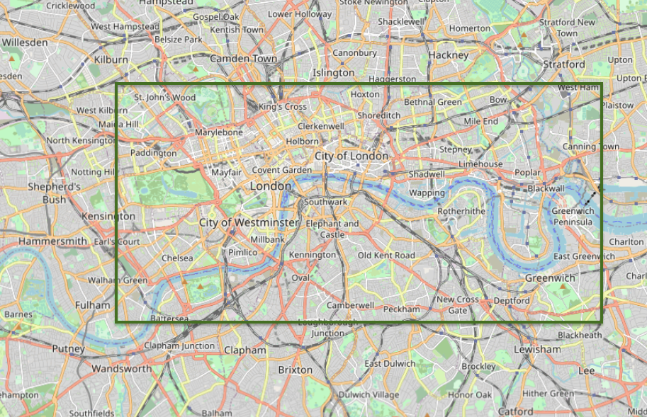

# Enunciado de lo que hay que hacer

Vamos a repasar los conceptos adquiridos con los elementos vectoriales y alguno como el uso de los marcadores que ya hemos obtenido anteriormente.

La ubicación del proyecto, nos vamos a ir a la ciudad de "Londres". Usaremos OpenStreetMap para encontrarlo y ubicarnos con e objetivo de ir dibujando y añadiendo, todo lo que se va a pedir en este apartado.

Se pide realizar en este proyecto:

* Añadir un marcador con un Pop Up en la ubicación exacta donde nos da como resultado al buscar "Londres". En el Pop up, añadiremos la información de la ciudad (Londres), una pequeña descripción como "Capital de Inglaterra y del Reino Unido", enlace a la Wikipedia (https://es.wikipedia.org/wiki/Londres) y una foto de referencia, intentando ajustarlo de la mejor manera posible.

* Añadir un círculo en "Camden Town" de 500m con color del borde rosa o un tono rosa, grosor del borde de 6px y el relleno con color en tono azul y una opacidad de 0.5. Añadimos un Tooltip con una información "Camden Town".

* Añadir un rectángulo apróximado para marcar la zona de lo que era Londres en 1806. Añado una imagen a continuación para que nos hagamos una idea y añadamos el rectángulo con las siguientes características: color: #36b6c7

* Añadir otro círculo que rodee el "Big Ben". El radio en metros, colores y demás características, a vuestra elección.

* Añadir un trazo con Polylines que recorre "Buckingham Palace Road" hasta "Grosvenor Gardens". Podéis añadirlo con las características que queráis y tiene que ser algo aproximado, pero intentad que siga el camino sin salirse de la carretera. Para ello, tendremos que unirlos por varios tramos. Opciones: grosor: 8 y color: #e8c889

Ahora que ya tenemos todo esto, vamos a centrar y ejecutar el zoom correctamente. Recordad que un buen truco, es crear un rectángulo imaginario para que englobe todos los puntos.

